# Workshop
## Prepare the app
1) first of all we will execute the app using spring :  
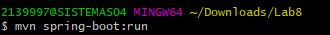  
and then when it executes we notice that it is running on port 5000:  
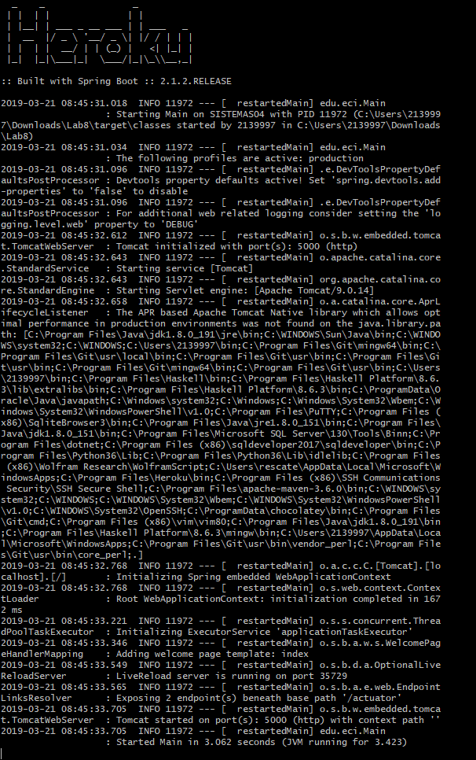  
 so we run the localhost:5000  
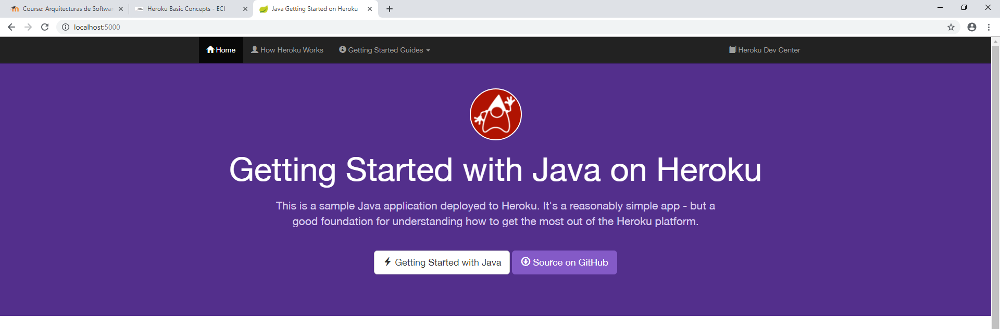   
finally we refer to /users and /cars
  
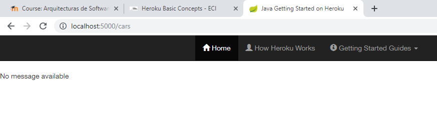  
as we notice users is implented but cars is not.  
2) the application works as a database to save,consult,update and remove users and cars, each user has a name and a UUID(an identifier)
and each car has a licenseplate and a brand.  
3)following we can find the REST services for users:
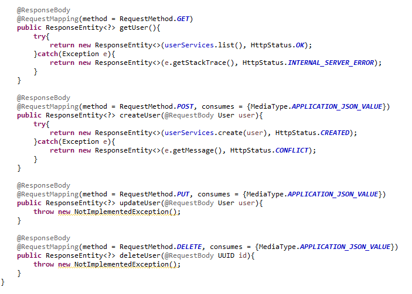  
we notice that the methods get and post are implemented but put and delete are not.
the getUsermethod goes to userservices and ask for a list of all the users in there.  
the post method receives a json representation of a user and then map it into a user object and this object is finally created on the services.  
and for the cars:  
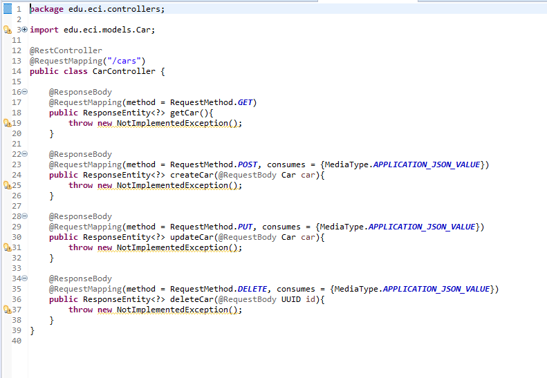  
as we can see there is nothing implemented but the main idea behind those methods is the same as the user ones, a CRUD for each class.  
4) the procfile is a file that specifies the commands to execute on startup, it can be used to specify many proccess types such as :  
	-the web server of the app  
	-multiple types of workers  
	-a singleon  
	-tasks to run before a release is deployed  
(https://devcenter.heroku.com/articles/procfile)
## Deploy the app
now we are going to deploy the app so we write the command:  
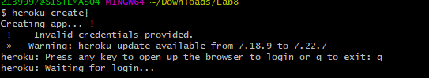  
it will requer us to login so we insert our credentials and proceed:
  
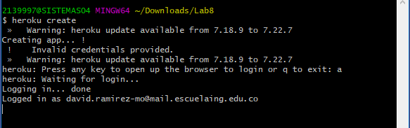  
and finally it creates the app and give us the links:
https://glacial-gorge-41471.herokuapp.com/ | https://git.heroku.com/glacial-gorge-41471.git  
now we are going to generate the git, so for this we apply the next commands:  
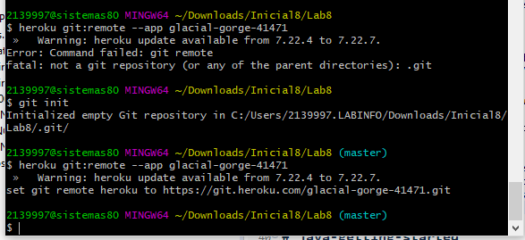  
then we can apply the git commands as usual.  
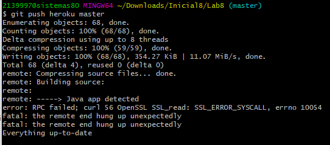  
with the app running we apply the command heroku ps:scale web=1 
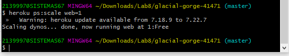  
and we open it  
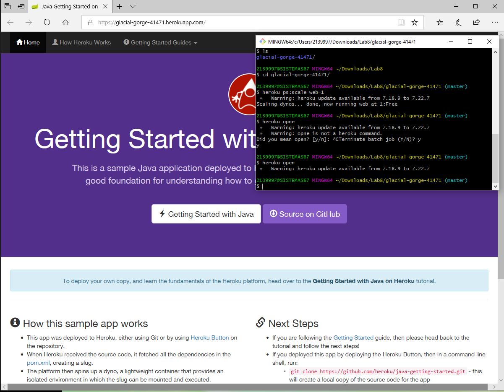
 
# java-getting-started

A barebones Java app, which can easily be deployed to Heroku.

This application supports the [Getting Started with Java on Heroku](https://devcenter.heroku.com/articles/getting-started-with-java) article - check it out.

[](https://heroku.com/deploy)

## Running Locally

Make sure you have Java and Maven installed.  Also, install the [Heroku CLI](https://cli.heroku.com/).

```sh
$ git clone https://github.com/heroku/java-getting-started.git
$ cd java-getting-started
$ mvn install
$ heroku local:start
```

Your app should now be running on [localhost:5000](http://localhost:5000/).

## Deploying to Heroku

```sh
$ heroku create
$ git push heroku master
$ heroku open
```

## Postman Testing

Use the following postman collection to test the REST API.

[Postman Collection](https://www.getpostman.com/collections/316dc4d4e748fe9810e9) 

## Documentation

For more information about using Java on Heroku, see these Dev Center articles:

- [Java on Heroku](https://devcenter.heroku.com/categories/java)

